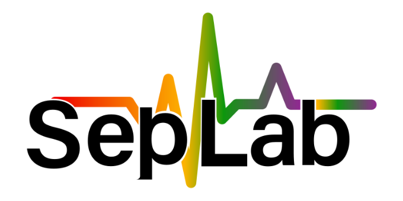

# SPME-DoEjo ⚗️


**SPME-DoEjo** is a prototypical web-based tool for optimizing Solid-Phase Microextraction (SPME) parameters using a Box-Behnken Design (BBD). It allows users to input CAS numbers, select the correct compounds, specify experimental properties, and generate optimized SPME conditions.

---

## Features 

- Input multiple CAS numbers (comma- or line-separated).
- Auto-resolve PubChem CIDs and IUPAC names.
- Select compounds when multiple matches exist.
- Specify experimental properties:
  - Charged / Ionic compounds
  - High matrix viscosity
- Adjust the number of Box-Behnken Design center points.
- Generate a complete BBD table for SPME parameter optimization.
- Identify the appropriate fiber for your experiments.
- Light / dark mode theme toggle. 
- Responsive, modern interface using Bootstrap 5.

---

## Online Access 🌐

You can access SPME-DoEjo here: https://spme-doejo.onrender.com

> Note that you may have to wait a couple of seconds for the Render runner to boot-up and serve the content.

---

## Local Usage/Development 🖥️

1. Clone the repository:

```bash
git clone https://github.com/nikosdelijohn/spme-doejo.git
cd spme-doejo
```

2. Create a Python virtual environment:

```bash
python -m venv venv
source venv/bin/activate  # Linux / macOS
venv\Scripts\activate     # Windows
```

3. Install required packages:

```bash
pip install -r requirements.txt
```

4. Run the Flask app:

```bash
python backend.py
```

5. Open your browser and navigate to:

```
http://127.0.0.1:5000/
```

---

## Usage 🤔

1. Enter CAS numbers in the text area.  
2. Click **Resolve Compounds**.  
3. Review the resolved compounds:
   - Auto-selected if only one option.  
   - Manually select if multiple options exist.  
4. Check additional experimental properties if applicable.  
5. Set the number of Box-Behnken Design center points.  
6. Click **Finalize Selection** to generate the BBD table.  
7. View the optimized SPME design in the results section.

---

## Project Structure 🦴

```
spme-doejo/
│
├─ backend.py                 # Flask backend routes and logic (dev/testing)
├─ backend_wsgi.py            # Flask backend routes and logic (gunicorn)
├─ requirements.txt           # Python dependencies
├─ templates/
│   └─ frontend.html          # Main HTML & JS frontend
├─ static/
│   ├─ style.css              # Custom CSS
│   ├─ favicon.ico            # Site favicon
│   └─ (other static assets)
└─ spme_doejo/                # Backend objects
    ├─ __init__.py
    ├─ compound.py
    ├─ parameters.py      
    ├─ spme_conditions.py
    └─ wsgi.py                # gunicorn entry point
```

---

## Notes

- The app relies on **PubChemPy** to fetch compound information by CID.  
- Session storage is used to temporarily store compound objects per user.  
- The Box-Behnken Design is generated using **pyDOE3**.  
- Theme switching is handled client-side via a checkbox toggle.  

---

## Contributing 🤝

Contributions are welcome! Please follow standard GitHub workflow: fork, branch, PR.

---

## License 📜

[Apache-2.0](LICENSE)

---
## Contact Info 📬

```
Laboratory of Analytical Chemistry  
School of Chemistry, AUTH Thessaloniki, Greece, 54124  
```

**Researchers:**
- **Maria Kousi 👩‍🔬** – [Email](mailto:mkousib@chem.auth.gr?subject=SPME-DoeJo)
- **Natasa Kalogiouri 👩‍🏫** – [Email](mailto:kalogiourin@chem.auth.gr?subject=SPME-DoeJo)


 
